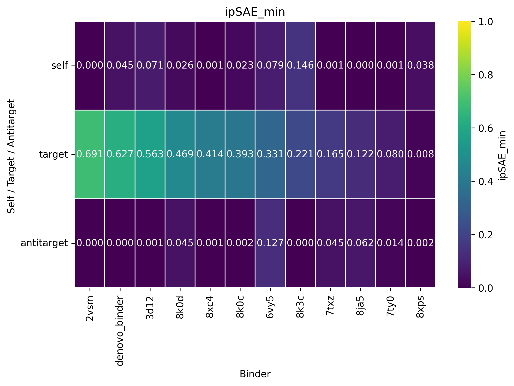

# Boltz2_IpSAE

This repository contains scripts for co-folding using Boltz2, calculating and visualising [ipSAE](https://github.com/DunbrackLab/IPSAE) metric. With a single .yaml file you can cofold your binder to multiple targets and itself to monitor specificity of binding.




## How to Run

1.  **Clone the repository and set up the [`Boltz2`](https://github.com/jwohlwend/boltz) environment.**
2.  **Navigate to the example directory:**

    ```bash
    cd ./Boltz2_IpSAE/example_run
    ```

3.  **Run the main script to generate the validation scripts:**

    ```bash
    python ../make_binder_validation_scripts.py --config config.yaml
    ```

4.  **Run all co-folding validation scripts with a single script**

    ```bash
    ./boltz_validation/run_all_cofolding.sh
    ```

5.  **When co-folding is done, visualize the results:**
a
    ```bash
    ./boltz_validation/visualise_cofolding_results.sh
    ```

This will generate a plot of the results, which will be saved in the `boltz_validation/summary` directory.

## Ligands in config

You can add ligands directly in config entries:

- `binders[*].ligand_ccd` / `binders[*].ligand_smiles`
- `targets[*].ligand_ccd` / `targets[*].ligand_smiles` (only when `role` is `target` or `antitarget`)

Each key accepts a single string or a list. Repeated ligand values are grouped into one Boltz ligand entity with multiple chain IDs (for example `id: [LA, LB]`).

For `targets[*].role: self`, ligand keys are not allowed; self runs inherit ligands from the binder entry.

## Optional monomer RMSD column

Set `visualisation.RMSD_to_binder_monomer: true` to:

- generate an extra binder-only monomer Boltz prediction per binder (same global Boltz params as pair runs),
- compute RMSD from each binder-vs-* model to all binder monomer models (average across monomer samples),
- append this value to existing rows as `RMSD_to_binder_monomer` in `summary/ipsae_summary_all_binders.csv`.
